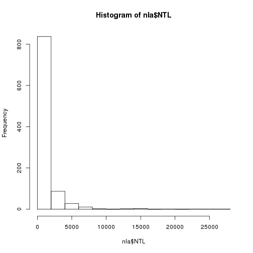
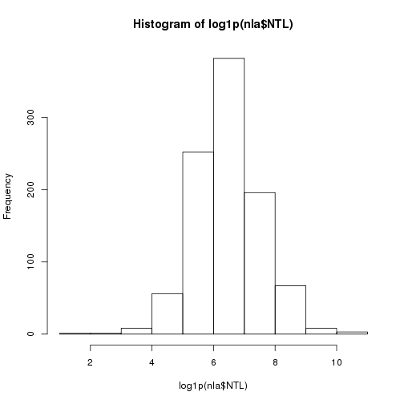
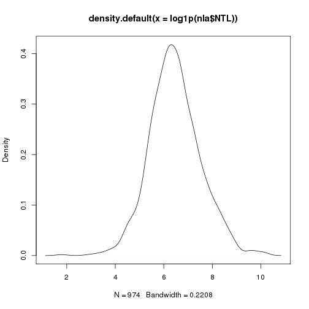
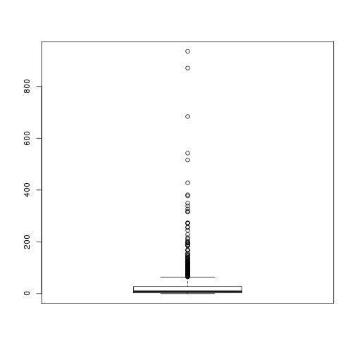
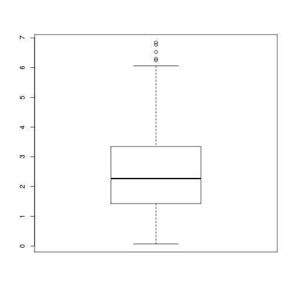
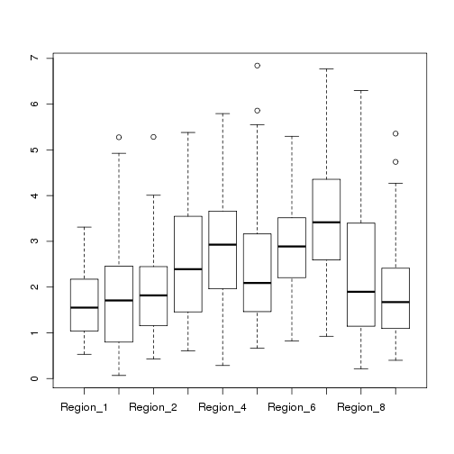
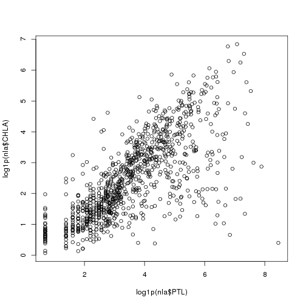
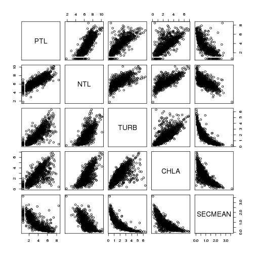
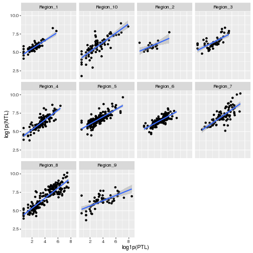
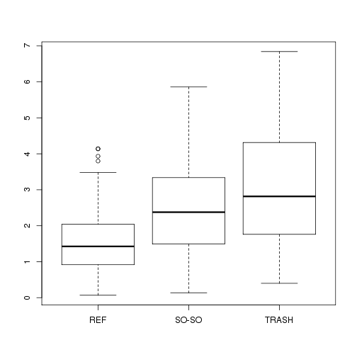

# Introduction
This notebook will cover calculating basic statistics with R, conducting statistical tests, and building simple linear models.  We will use the 2007 NLA data for the examples and show steps from getting data, to cleaning data, to analysis and statistics.

## Get Data
First step in any project will be getting the data read into R.  For this lesson we are using the 2007 National Lakes Assessment data, which ,luckily, can be accessed directly from a URL.  


```r
# URL for 2007 NLA water quality data
nla_wq_url <- "https://www.epa.gov/sites/production/files/2014-10/nla2007_chemical_conditionestimates_20091123.csv"

nla_secchi_url <- "https://www.epa.gov/sites/production/files/2014-10/nla2007_secchi_20091008.csv"

# Read into an R data.frame with read.csv
nla_wq <- read.csv(nla_wq_url, stringsAsFactors = FALSE)
nla_secchi <- read.csv(nla_secchi_url, stringsAsFactor = FALSE)
```

### Challenge
1. Make sure you have both nla_wq and nla_secchi data.frames read in successfully.
2. How many rows are in nla_wq?  
3. How many rows are in nla_secchi?
4. Using `names()` list out the column names to your screen.  

## Clean Data
So this dataset is a bit bigger than we probably want, let's do some clean up using `dplyr`.  We want to select out a few columns, filter out the data that we want and get our data.frame ready for futher analysis.


```r
#Load dplyr into current session
library(dplyr)

#Clean up NLA Water quality
nla_wq_cln <- nla_wq %>%
  filter(VISIT_NO == 1,
         SITE_TYPE == "PROB_Lake") %>%
  select(SITE_ID,ST,EPA_REG,RT_NLA,LAKE_ORIGIN,PTL,NTL,TURB,CHLA)

#Clean up NLA Secchi
nla_secchi_cln <- nla_secchi %>%
  filter(VISIT_NO == 1) %>%
  select(SITE_ID, SECMEAN)

#Join the two together based on SITE_ID and the finally filter out NA's
nla <- left_join(x = nla_wq_cln, y = nla_secchi_cln, by = "SITE_ID") %>%
  filter(complete.cases(NTL,PTL,TURB,CHLA,SECMEAN))
tbl_df(nla)
```

```
## Source: local data frame [974 x 10]
## 
##          SITE_ID    ST  EPA_REG RT_NLA LAKE_ORIGIN   PTL   NTL   TURB
##            <chr> <chr>    <chr>  <chr>       <chr> <int> <int>  <dbl>
## 1  NLA06608-0001    MT Region_8    REF     NATURAL     6   151  0.474
## 2  NLA06608-0002    SC Region_4  SO-SO    MAN-MADE    36   695  3.550
## 3  NLA06608-0003    TX Region_6  TRASH     NATURAL    43   738  7.670
## 4  NLA06608-0004    CO Region_8  SO-SO    MAN-MADE    18   344  3.810
## 5  NLA06608-0006    CT Region_1    REF    MAN-MADE     7   184  0.901
## 6  NLA06608-0007    WI Region_5    REF     NATURAL     8   493  1.050
## 7  NLA06608-0008    IA Region_7  SO-SO    MAN-MADE    66   801  8.620
## 8  NLA06608-0010    MI Region_5  SO-SO     NATURAL    10   473  3.050
## 9  NLA06608-0012    OK Region_6  TRASH    MAN-MADE   159  1026 50.300
## 10 NLA06608-0013    NJ Region_2  SO-SO    MAN-MADE    28   384  4.210
## ..           ...   ...      ...    ...         ...   ...   ...    ...
## Variables not shown: CHLA <dbl>, SECMEAN <dbl>.
```

So now we have a dataset ready for analysis.

### Challenge
1. Using `filter()` and `select()` see if you can create a new data frame that has just NTL and PTL for the state of Rhode Island.

## Analyze Data

### Basic Stats
First step in analyzing a dataset like this is going to be to dig through some basic statistics as well as some basic plots.  

We can get a summary of the full data frame:


```r
#Get a summary of the data frame
summary(nla)
```

```
##    SITE_ID               ST              EPA_REG         
##  Length:974         Length:974         Length:974        
##  Class :character   Class :character   Class :character  
##  Mode  :character   Mode  :character   Mode  :character  
##                                                          
##                                                          
##                                                          
##     RT_NLA          LAKE_ORIGIN             PTL              NTL         
##  Length:974         Length:974         Min.   :   1.0   Min.   :    5.0  
##  Class :character   Class :character   1st Qu.:  11.0   1st Qu.:  329.5  
##  Mode  :character   Mode  :character   Median :  30.0   Median :  603.5  
##                                        Mean   : 114.1   Mean   : 1190.5  
##                                        3rd Qu.: 100.0   3rd Qu.: 1214.2  
##                                        Max.   :4679.0   Max.   :26100.0  
##       TURB              CHLA            SECMEAN       
##  Min.   :  0.237   Min.   :  0.070   Min.   : 0.0400  
##  1st Qu.:  1.643   1st Qu.:  3.163   1st Qu.: 0.6125  
##  Median :  4.145   Median :  8.670   Median : 1.3000  
##  Mean   : 14.133   Mean   : 30.884   Mean   : 2.0759  
##  3rd Qu.: 11.675   3rd Qu.: 27.492   3rd Qu.: 2.7475  
##  Max.   :574.000   Max.   :936.000   Max.   :36.7100
```

Or, we can pick and choose what stats we want.  For instance:


```r
#Stats for Total Nitrogen
mean(nla$NTL)
```

```
## [1] 1190.468
```

```r
median(nla$NTL)
```

```
## [1] 603.5
```

```r
min(nla$NTL)
```

```
## [1] 5
```

```r
max(nla$NTL)
```

```
## [1] 26100
```

```r
sd(nla$NTL)
```

```
## [1] 2122.182
```

```r
IQR(nla$NTL)
```

```
## [1] 884.75
```

```r
range(nla$NTL)
```

```
## [1]     5 26100
```

In these cases we took care of our NA values during our data clean up, but there may be reasons you would not want to do that.  If you retained NA values, you would need to think about how to handle those.  One way is to remove it from the calculation of the statistics using the `na.rm = TRUE` argument.  For instance:


```r
#An example with NA's
x <- c(37,22,NA,41,19)
mean(x) #Returns NA
```

```
## [1] NA
```

```r
mean(x, na.rm = TRUE) #Returns mean of 37, 22, 41, and 19
```

```
## [1] 29.75
```

It is also useful to be able to return some basic counts for different groups.  For instance, how many lakes in the NLA were natural and how many were man made.


```r
#The table() funciton is usefule for returning counts
table(nla$LAKE_ORIGIN)
```

```
## 
## MAN-MADE  NATURAL 
##      568      406
```

The `table()` function is also useful for looking at multiple columns at once.  A contrived example of that:


```r
x <- c(1,1,0,0,1,1,0,0,1,0,1,1)
y <- c(1,1,0,0,1,0,1,0,1,0,0,0)
xy_tab <- table(x,y)
xy_tab
```

```
##    y
## x   0 1
##   0 4 1
##   1 3 4
```

```r
prop.table(xy_tab)
```

```
##    y
## x            0          1
##   0 0.33333333 0.08333333
##   1 0.25000000 0.33333333
```

Lastly, we can combine these with some `dplyr` and get summary stats for groups.  


```r
orig_stats_ntl <- nla %>%
  group_by(LAKE_ORIGIN) %>%
  summarize(mean_ntl = mean(NTL),
            median_ntl = median(NTL),
            sd_ntl = sd(NTL))
orig_stats_ntl
```

```
## Source: local data frame [2 x 4]
## 
##   LAKE_ORIGIN  mean_ntl median_ntl    sd_ntl
##         <chr>     <dbl>      <dbl>     <dbl>
## 1    MAN-MADE  842.8644      544.5  961.5889
## 2     NATURAL 1676.7709      688.0 3019.7433
```

And, just because it is cool, a markdown table!


```r
knitr::kable(orig_stats_ntl)
```


|LAKE_ORIGIN |  mean_ntl| median_ntl|    sd_ntl|
|:-----------|---------:|----------:|---------:|
|MAN-MADE    |  842.8644|      544.5|  961.5889|
|NATURAL     | 1676.7709|      688.0| 3019.7433|

### Challenge
1. Look at some of the basic stats for other columns in our data.  What is the standard deviation for PTL?  What is the median Secchi depth?  Play around with others.
2. Using some `dplyr` magic, let's look at mean Secchi by reference class (RT_NLA). 
3. The `quantile()` function allows greater control over getting different quantiles of your data.  For instance you can use it to get the min, median and max with `quantile(nla$NTL, probs = c(0,0.5,1))`.  Re-write this function to return the 33 and 66 quantiles.

### Some quick useful viz

While visualization isn't the point of this lesson, some things are useful to do at this stage of analysis.  In particular is looking at distributions and some basic scatterplots.

We can look at histograms and density:


```r
#A single histogram using base
hist(nla$NTL)
```



```r
#Log transform it
hist(log1p(nla$NTL)) #log1p adds one to deal with zeros
```



```r
#Density plot
plot(density(log1p(nla$NTL)))
```



And boxplots:


```r
#Simple boxplots
boxplot(nla$CHLA)
```



```r
boxplot(log1p(nla$CHLA))
```



```r
#Boxplots per group
boxplot(log1p(nla$CHLA)~nla$EPA_REG)
```



And scatterplots:


```r
#A single scatterplot
plot(log1p(nla$PTL),log1p(nla$CHLA))
```



```r
#A matrix of scatterplot
plot(log1p(nla[,6:10]))
```




Lastly, it might be nice to look at these on a per variable basis or on some grouping variable. First we could look at the density of each measured variable. This requires some manipulation of the data which will allow us to use facets in ggplot to create a density distribution for each of the variables.


```r
#Getting super fancy with tidyr, plotly, and ggplot2 to visualize all variables
library(tidyr)
library(ggplot2)
library(plotly)
nla_gather <- gather(nla,parameter,value,6:10)
dens_gg <-ggplot(nla_gather,aes(x=log1p(value))) +
  geom_density() +
  facet_wrap("parameter") +
  labs(x="log1p of measured value")
ggplotly(dens_gg)
```

```
## Error in file(con, "rb"): cannot open the connection
```

Next we could look at a scatterplot matrix of the relationship between phosphorus and chlorophyl by each EPA Region.  No need to re-do the shape of the data frame for this one.


```r
ggplot(nla, aes(x=log1p(PTL),y=log1p(NTL))) +
  geom_point() +
  geom_smooth(method = "lm") +
  facet_wrap("EPA_REG")
```



### Challenge
1. Build a scatterplot that looks at the relationship between PTL and NTL.  
2. Build a boxplot that shows a boxplot of secchi by the reference class (RT_NLA)/

## Some tests: t-test and ANOVA
There are way more tests than we can show examples for.  For today we will show two very common and straightforward tests.  The t-test and an ANOVA.

### t-test
First we will look at the t-test to test and see if `LAKE_ORIGIN` shows a difference in `SECMEAN`.  In other words can we expect a difference in clarity due to whether a lake is man-made or natural.  This is a two-tailed test. There are two approaches for this 1) using the formula notation if your dataset is in a "long" format or 2) using two separate vectors if your dataset is in a "wide" format.


```r
#Long Format - original format for LAKE_ORIGIN and SECMEAN
t.test(nla$SECMEAN ~ nla$LAKE_ORIGIN)
```

```
## 
## 	Welch Two Sample t-test
## 
## data:  nla$SECMEAN by nla$LAKE_ORIGIN
## t = -4.7252, df = 611.31, p-value = 2.854e-06
## alternative hypothesis: true difference in means is not equal to 0
## 95 percent confidence interval:
##  -1.0972582 -0.4529701
## sample estimates:
## mean in group MAN-MADE  mean in group NATURAL 
##               1.752817               2.527931
```

```r
#Wide Format - need to do some work to get there - tidyr is handy!
wide_nla <- spread(nla,LAKE_ORIGIN,SECMEAN)
names(wide_nla)[9:10]<-c("man_made", "natural")
t.test(wide_nla$man_made, wide_nla$natural)
```

```
## 
## 	Welch Two Sample t-test
## 
## data:  wide_nla$man_made and wide_nla$natural
## t = -4.7252, df = 611.31, p-value = 2.854e-06
## alternative hypothesis: true difference in means is not equal to 0
## 95 percent confidence interval:
##  -1.0972582 -0.4529701
## sample estimates:
## mean of x mean of y 
##  1.752817  2.527931
```

Same results, two different ways to approach.  Take a look at the help (e.g. `?t.test`) for more details on other types of t-tests (e.g. paired, one-tailed, etc.)

### ANOVA
ANOVA can get involved quickly and I haven't done them since my last stats class, so I'm not the best to talk about these, but the very basics require fitting a model and wrapping that in the `aov` function.  In the [Getting More Help section](#getting-more-help) I provide a link that would be a good first start for you ANOVA junkies.  For today's lesson though, lets look at the simple case of a one-vay analysis of variance and check if reference class results in differences in our chlorophyll


```r
# A quick visual of this:
boxplot(log1p(nla$CHLA)~nla$RT_NLA)
```



```r
# One way analysis of variance
nla_anova <- aov(log1p(CHLA)~RT_NLA, data=nla)
nla_anova #Terms
```

```
## Call:
##    aov(formula = log1p(CHLA) ~ RT_NLA, data = nla)
## 
## Terms:
##                    RT_NLA Residuals
## Sum of Squares   151.9282 1508.3926
## Deg. of Freedom         2       971
## 
## Residual standard error: 1.246372
## Estimated effects may be unbalanced
```

```r
summary(nla_anova) #The table
```

```
##              Df Sum Sq Mean Sq F value Pr(>F)    
## RT_NLA        2  151.9   75.96    48.9 <2e-16 ***
## Residuals   971 1508.4    1.55                   
## ---
## Signif. codes:  0 '***' 0.001 '**' 0.01 '*' 0.05 '.' 0.1 ' ' 1
```

```r
anova(nla_anova) #The table with a bit more
```

```
## Analysis of Variance Table
## 
## Response: log1p(CHLA)
##            Df  Sum Sq Mean Sq F value    Pr(>F)    
## RT_NLA      2  151.93  75.964  48.901 < 2.2e-16 ***
## Residuals 971 1508.39   1.553                      
## ---
## Signif. codes:  0 '***' 0.001 '**' 0.01 '*' 0.05 '.' 0.1 ' ' 1
```

## Correlations and Linear modeling
The last bit of basic stats we will cover is going to be linear relationships.

### Correlations
Let's first take a look at correlations.  These can be done with `cor()`.


```r
#For a pair
cor(log1p(nla$PTL),log1p(nla$NTL))
```

```
## [1] 0.8065128
```

```r
#For a correlation matrix
cor(log1p(nla[,6:10]))
```

```
##                PTL        NTL       TURB       CHLA    SECMEAN
## PTL      1.0000000  0.8065128  0.8019849  0.7204703 -0.7548438
## NTL      0.8065128  1.0000000  0.6995560  0.7342557 -0.6992012
## TURB     0.8019849  0.6995560  1.0000000  0.7225992 -0.8435743
## CHLA     0.7204703  0.7342557  0.7225992  1.0000000 -0.7823140
## SECMEAN -0.7548438 -0.6992012 -0.8435743 -0.7823140  1.0000000
```

```r
#Spearman Rank Correlations
cor(log1p(nla[,6:10]),method = "spearman")
```

```
##                PTL        NTL       TURB       CHLA    SECMEAN
## PTL      1.0000000  0.8185463  0.8367840  0.7564151 -0.8199255
## NTL      0.8185463  1.0000000  0.7218904  0.7208925 -0.7176582
## TURB     0.8367840  0.7218904  1.0000000  0.7852845 -0.9305093
## CHLA     0.7564151  0.7208925  0.7852845  1.0000000 -0.8151644
## SECMEAN -0.8199255 -0.7176582 -0.9305093 -0.8151644  1.0000000
```

You can also test for differences using:


```r
cor.test(log1p(nla$PTL),log1p(nla$NTL))
```

```
## 
## 	Pearson's product-moment correlation
## 
## data:  log1p(nla$PTL) and log1p(nla$NTL)
## t = 42.53, df = 972, p-value < 2.2e-16
## alternative hypothesis: true correlation is not equal to 0
## 95 percent confidence interval:
##  0.7833848 0.8274104
## sample estimates:
##       cor 
## 0.8065128
```

### Linear models
Basic linear models in R can be built with the `lm()` function.  If you aren't buiding stadard least squares regressin models, (e.g. logistic) or aren't doing linear models then you will need to look elsewhere (e.g `glm()`, or `nls()`).  For today our focus is going to be on simple linear models.  Let's look at our ability to model chlorophyll, given the other variables we have.


```r
# The simplest case
chla_tp <- lm(log1p(CHLA) ~ log1p(PTL), data=nla) #Creates the model
summary(chla_tp) #Basic Summary
```

```
## 
## Call:
## lm(formula = log1p(CHLA) ~ log1p(PTL), data = nla)
## 
## Residuals:
##     Min      1Q  Median      3Q     Max 
## -5.1824 -0.4899 -0.0176  0.5734  2.7511 
## 
## Coefficients:
##             Estimate Std. Error t value Pr(>|t|)    
## (Intercept)  0.20573    0.07589   2.711  0.00683 ** 
## log1p(PTL)   0.63607    0.01964  32.390  < 2e-16 ***
## ---
## Signif. codes:  0 '***' 0.001 '**' 0.01 '*' 0.05 '.' 0.1 ' ' 1
## 
## Residual standard error: 0.9064 on 972 degrees of freedom
## Multiple R-squared:  0.5191,	Adjusted R-squared:  0.5186 
## F-statistic:  1049 on 1 and 972 DF,  p-value: < 2.2e-16
```

```r
names(chla_tp) #The bits
```

```
##  [1] "coefficients"  "residuals"     "effects"       "rank"         
##  [5] "fitted.values" "assign"        "qr"            "df.residual"  
##  [9] "xlevels"       "call"          "terms"         "model"
```

```r
chla_tp$coefficients #My preference
```

```
## (Intercept)  log1p(PTL) 
##   0.2057317   0.6360718
```

```r
coef(chla_tp) #Same thing, but from a function
```

```
## (Intercept)  log1p(PTL) 
##   0.2057317   0.6360718
```

```r
head(resid(chla_tp)) # The resdiuals
```

```
##           1           2           3           4           5           6 
## -1.22835884 -0.92561993  0.27539916 -0.35583962  0.09690549 -0.37076398
```

We can also do multiple linear regression.


```r
chla_tp_tn_turb <- lm(log1p(CHLA) ~ log1p(PTL) + log1p(NTL) + log1p(TURB), data = nla)
summary(chla_tp_tn_turb)
```

```
## 
## Call:
## lm(formula = log1p(CHLA) ~ log1p(PTL) + log1p(NTL) + log1p(TURB), 
##     data = nla)
## 
## Residuals:
##     Min      1Q  Median      3Q     Max 
## -4.5990 -0.4362  0.0293  0.5239  2.2750 
## 
## Coefficients:
##             Estimate Std. Error t value Pr(>|t|)    
## (Intercept) -1.77639    0.19696  -9.019  < 2e-16 ***
## log1p(PTL)   0.11454    0.03535   3.240  0.00123 ** 
## log1p(NTL)   0.47798    0.04149  11.522  < 2e-16 ***
## log1p(TURB)  0.40360    0.03833  10.529  < 2e-16 ***
## ---
## Signif. codes:  0 '***' 0.001 '**' 0.01 '*' 0.05 '.' 0.1 ' ' 1
## 
## Residual standard error: 0.7973 on 970 degrees of freedom
## Multiple R-squared:  0.6287,	Adjusted R-squared:  0.6275 
## F-statistic: 547.4 on 3 and 970 DF,  p-value: < 2.2e-16
```

There's a lot more we can do with linear models including dummy variables (character or factors will work), interactions, etc.  That's a bit more than we want to get into.  Again the link below is a good place to start for more info.

### Challenge
1. Use `lm()` to look at using secchi depth to predict chlorophyll.

## Getting More Help
One nice site that covers basic stats in R is [Quick R: Basic Statistics](http://www.statmethods.net/stats/index.html).  There are others, but that is a good first stop.
